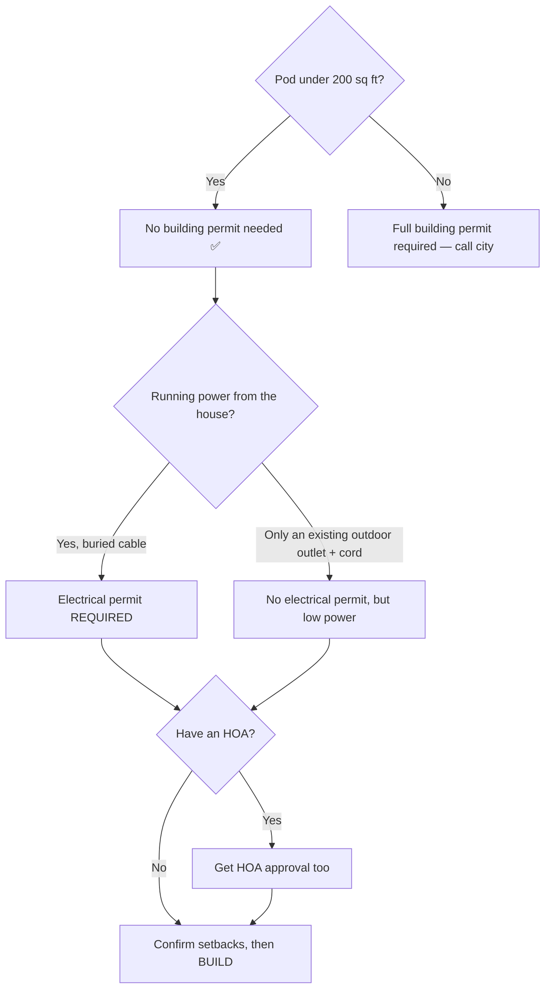

# 1. 🧾 El Paso Permit Checklist

**Do this BEFORE you buy anything.** Confirming the rules first can save you thousands.

> This is guidance, not legal advice. The El Paso One-Stop Shop is the final word.
> **☎️ One-Stop Shop: (915) 212-0104** · 811 Texas Ave · OSSHelp@elpasotexas.gov
> Online portal: https://aca-prod.accela.com/elpaso

---

## ✅ The short version

| Question | Answer for these pods |
|----------|----------------------|
| Do I need a **building permit** for the pod itself? | **No** — if it's under 200 sq ft (all 3 pods are). |
| Do I need an **electrical permit**? | **Yes** — the power line from your house is fixed wiring. |
| Do I need to follow **setbacks** (distance from fence)? | **Yes** — always. |
| Do I need **HOA approval**? | **Maybe** — if you have an HOA, ask them too. |

**Why no building permit?** El Paso uses the International Residential Code (IRC). Rule
**R105.2** says a *one-story detached accessory structure of 200 sq ft or less* does not need
a building permit. Your pod is 80–105 sq ft, so the **structure** is exempt. ✅

**Why still an electrical permit?** The exemption above only covers the *box*. Running a
buried power cable from your house panel is **permanent electrical work**, which always needs a
permit and an inspection. (Only a simple extension cord to an existing outdoor plug is exempt —
but that's not enough power for an AC + computer, so don't rely on it.)

---

## 📋 Step-by-step permit checklist

### Step 1 — Find your property's rules
- [ ] Open the **[El Paso Zoning Map](https://experience.arcgis.com/experience/0bccd5cf93c4450ca9f2e8a0e57a2279/)** and type in your address.
- [ ] Write down your **zoning district** (e.g., R-1, R-2, etc.): ________________
- [ ] Open the **[Flood Zone Map](https://city-of-el-paso-open-data-coepgis.hub.arcgis.com/apps/71e293fd6ade47fb93a9f6aad8739299/explore)** — check you're **not** in a flood zone. In a flood zone? Call the city before doing anything.

### Step 2 — Confirm the setbacks (how far from the fence/house)
- [ ] Call the One-Stop Shop and ask: *"What are the rear and side setbacks for a detached
      accessory structure in my zoning district?"* (Often **3–5 ft** from the rear/side property line.)
- [ ] Rear setback: ______ ft   ·   Side setback: ______ ft
- [ ] Measure your yard and mark where the pod legally fits.
- [ ] Keep it **at least the setback distance** from every property line.

### Step 3 — Check the extras
- [ ] **HOA?** If yes, submit the design for approval before building.
- [ ] Don't block a utility easement (usually along the back fence). Ask the city if unsure.
- [ ] Locate underground utilities before placing feet — **call 811 (free "Call Before You Dig")**.

### Step 4 — Pull the electrical permit
- [ ] Decide: are **you** wiring it, or a **licensed electrician**? (Texas usually requires a
      licensed electrician to pull the permit unless you're the homeowner doing your own work —
      **confirm with the city**.)
- [ ] Apply via the **[Citizen Access Portal](https://aca-prod.accela.com/elpaso)** or in person.
- [ ] Budget ~**$200 residential deposit** (credited toward the final permit fee).
- [ ] Schedule the required inspections (rough wiring, then final).

### Step 5 — Keep records
- [ ] Save your permit number: ________________
- [ ] Keep a copy of the permit on-site during the build (required).
- [ ] Book the **final inspection** when wiring is done.

---

## 🚦 Simple decision flow

---

## ❓ Questions to ask when you call (copy/paste)

> "Hi — I want to put a **detached backyard office under 200 square feet** on adjustable
> feet (no concrete slab). Three questions:
> 1. Is that correct that it needs **no building permit** under IRC R105.2?
> 2. What are my **setbacks** for zoning district ____?
> 3. What do I need for an **electrical permit** to run a buried 120V circuit from my house?"

Next → **[02-materials-and-tools.md](02-materials-and-tools.md)**
