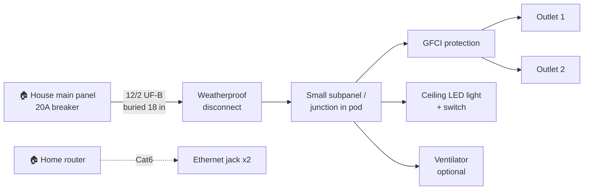
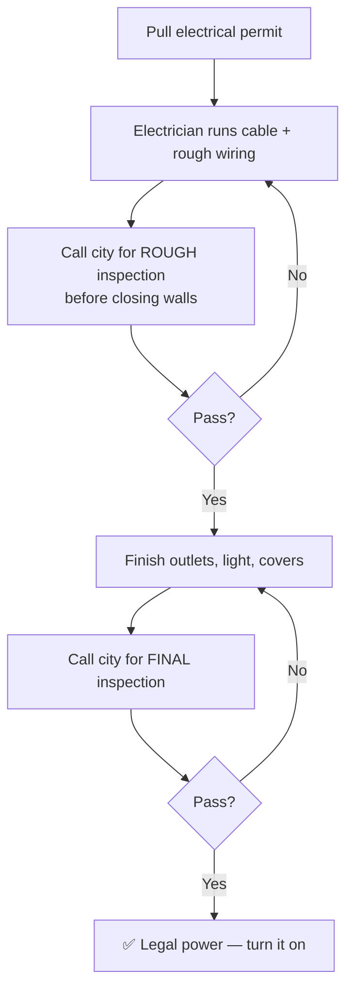

# 4. ⚡ Electrical Wiring Guide + Schematic

> 🛑 **Safety + legal:** The connection to your house panel is **permanent electrical work**.
> In El Paso it needs an **electrical permit + inspection** (see guide 1). Have a **licensed
> electrician** do the house-panel connection and final hookup. This page helps you *understand*
> and *plan* the system so you can talk to your electrician and pass inspection.

---

## 🔌 How the power flows (simple diagram)



**In words:** A 20-amp breaker in your house feeds a buried cable to the pod. Inside the pod, a
small subpanel/junction splits power to the **outlets** (GFCI-protected), the **light**, and the
**fan**. Ethernet is separate low-voltage — it just runs alongside for internet.

---

## 🗺️ Physical layout (top view of the Core pod)

```
   ┌─────────────── back wall ───────────────┐
   │  [Light L1 on ceiling, centered]         │
   │                                          │
   │ (Outlet O1)                  (Outlet O2) │
   │                                          │
   │  [Subpanel/junction + disconnect]        │
   │        ▲ cable enters here               │
   └────────┼──────── DOOR ───── GLASS ───────┘
            │
     buried 12/2 UF-B cable
            │
            ▼
      🏠 to house panel
```

---

## 📋 Wiring checklist (what gets installed)

### Cable run (house → pod)
- [ ] **12/2 UF-B** direct-burial cable, buried **~18 inches** deep (electrician confirms local depth)
- [ ] Cable protected by **conduit** where it exits the ground / enters buildings
- [ ] Length = house-to-pod distance **+ ~10 ft slack**

### At the house
- [ ] Dedicated **20A breaker** in the main panel (electrician installs)

### At the pod
- [ ] **Weatherproof disconnect** where the cable enters
- [ ] Small **subpanel or junction box**
- [ ] **GFCI** protection on the outlet circuit (required for damp locations)
- [ ] **2 × wall outlets** (NEMA 5-15R) — Core. (Pro adds a floor outlet; Versatile has 5.)
- [ ] **1 × LED ceiling light** (12W) + wall switch by the door
- [ ] **Ventilator** wired in (Pro/Versatile)
- [ ] Everything **grounded** properly

### Low-voltage (optional, you can DIY this part — no permit)
- [ ] **Cat6** cable from the house router to the pod
- [ ] **2 × RJ45 keystone** jacks on a faceplate

---

## 🔢 Load sanity check (will a 20A circuit handle it?)

| Device | Rough watts |
|--------|-------------|
| Laptop + 2 monitors | ~200 W |
| LED light | ~12 W |
| Ventilator | ~50 W |
| Phone/misc chargers | ~100 W |
| **Subtotal (electronics)** | **~360 W** |
| Mini-split AC (9,000 BTU) | ~800–1,000 W |
| **Total** | **~1,200–1,400 W** |

A 120V / 20A circuit = **2,400 W** max, and you keep continuous load under 80% (~1,920 W).
So one 20A circuit is **usually enough** for a Core with a small mini-split. If you run a
**bigger AC or a space heater**, tell your electrician — you may want a **240V feed** or a
**second circuit**. ✅

---

## 🧾 Inspection steps (so you pass)



- [ ] **Rough inspection** happens **before** you close up walls (so the inspector can see the wiring).
- [ ] **Final inspection** happens after outlets/light/covers are on.
- [ ] Keep the permit on-site both times.

---

## ☀️ Optional: solar add-on

The design supports a roof **solar panel + charge controller** (see BOM "Optional"). This is a
bigger project — get the basic grid power working and inspected first, then add solar later if
you want off-grid backup.

Back to the **[guide index](README.md)**
