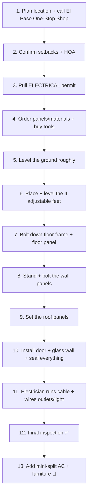

# 🏠 Backyard Home Office — Beginner Build Guide

**Plain-English, step-by-step instructions for building your own backyard office pod in El Paso, TX.**

This guide simplifies the technical CAD files in this repo into something a first-time
builder can actually follow. No jargon. Checklists. Pictures-as-diagrams. One step at a time.

> Based on the [Autonomous WorkPod](../README.md) open-hardware design (CC BY-NC-SA 4.0).

---

## 👶 Never built anything before? Read this first.

You do **not** need to be a carpenter. This design is basically a **big kit of flat panels
that bolt together** and sits on **4 adjustable feet** (like table legs you can screw up/down).
No concrete. No digging. The hardest part is being careful, level, and patient.

**The whole job is 5 phases:**

```
1. PLAN & PERMIT   →   2. BUY STUFF   →   3. FOUNDATION (feet)
        →   4. WALLS + ROOF (bolt panels)   →   5. ELECTRICAL (hire an electrician)
```

Expect **2–4 weekends** for a first-timer working with one helper.

---

## 📚 Read the guide in this order

| # | File | What it covers |
|---|------|----------------|
| 0 | **You are here** | Overview + pick your model |
| 1 | [01-permits-checklist.md](01-permits-checklist.md) | El Paso permits — what you legally need (do this FIRST) |
| 2 | [02-materials-and-tools.md](02-materials-and-tools.md) | Shopping list: materials + every tool, with checkboxes |
| 3 | [03-step-by-step-build.md](03-step-by-step-build.md) | The actual build, step by step, with diagrams |
| 4 | [04-electrical-wiring.md](04-electrical-wiring.md) | Power wiring diagram + what the electrician does |
| 5 | [05-measurements.md](05-measurements.md) | **Real dimensions** measured from the CAD files |
| 📄 | [cut-list-and-costs.csv](cut-list-and-costs.csv) | **Printable shopping spreadsheet** (opens in Excel/Sheets) |

---

## 🥇 Which pod should a beginner build?

**Build the [WorkPod Core](../cad/pod-core/). It's the simplest.** Here's why:

| | **Core (👈 recommended)** | Pro | Versatile |
|---|---|---|---|
| Size | 80 sq ft interior (~8.4 × 11.3 ft outer) | 102 sq ft | 105 sq ft |
| Feet to level | **4** (easiest) | 6 | 6 |
| Roof | **Flat** (simplest) | Sloped (harder) | Flat |
| Electrical | **2 outlets, 1 light** (simple) | +floor outlet, fan | 5 outlets, 4 lights, fan |
| Glass walls | **1** (fewer to seal) | 1 | 3 (most sealing/leak risk) |
| Best for | **Your first build** | More elbow room | Studio / lots of light |

> ✅ Real dimensions were measured from the CAD files — see **[05-measurements.md](05-measurements.md)**.
> The Core is **≈ 8.4 ft × 11.3 ft outer** (~80 sq ft interior), walls **≈ 7.7 ft tall**. Always
> confirm the exact size against the STEP file before you cut anything.

---

## 🌵 El Paso reality check (important)

- ☀️ **It gets 100°F+ here.** You **will** need a small air conditioner (a 6,000–9,000 BTU
  mini-split, or a portable AC). Budget for it now. See guide 2.
- 🧾 **"Skip permits" is only half true.** The *building* is small enough to skip a building
  permit, but the *electrical hookup* still needs a permit + inspection. See guide 1.
- 🧭 **Don't put a big glass wall facing due west** — afternoon sun will cook you.

---

## 🦺 Safety first (non-negotiable)

- Never work on live electrical. The electrician handles the power connection.
- Two people for lifting wall/roof panels. They are big and awkward.
- Safety glasses + gloves when cutting or drilling. A dust mask for foam/wood.
- Check the weather — don't set roof panels on a windy day.

---

## 🗺️ Big-picture map of the whole project



Next → **[01-permits-checklist.md](01-permits-checklist.md)**
